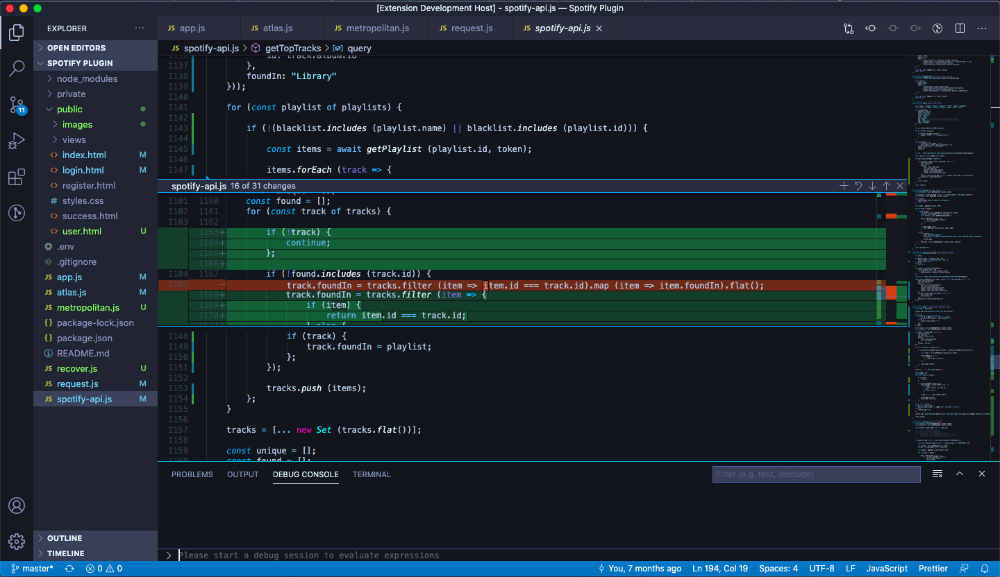

# Verglas for Visual Studio Code
## A dark color theme focusing on muted blue and grey colours.

*Note: This theme is still in beta, so some color rules may have not yet been set. To report issues, go to our [GitHub Repository](https://github.com/Zorlix/verglas-color-theme)*.